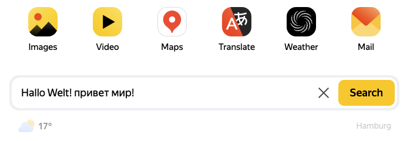

# What is this?

This is a JS snippet for tampermoney that will allow you to type russian letters using the german keyboard.

# How to use?

1. Install tampermonkey
2. Create a new script
3. Copy the code from the `index.js` file
4. Save the script
5. Go to the website where you want to type russian letters
6. Press `Ctrl + Shift` to switch to the russian layout (and back to the german layout)
7. Type russian letters using the german keyboard
8. Enjoy!

# Why?

If you only have a German keyboard and need to type Russian letters, this script will help you do it without any problems. Works with Telegram, Youtube, Yandex, etc.

# It doesn't work in MY_BROWSER

Yes, unfortunately this script doesn't work in some browsers, and it becomes even more annoying when it works in one version of the same browser but doesn't work in another. If it doesn't work, try a different browser and maybe it will work there.
